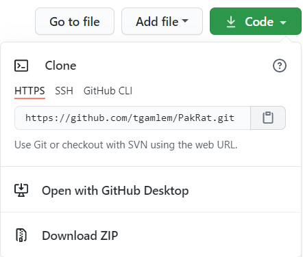

# Git Commands

```
Open Git Bash (or Terminal on Mac) to run all commands
```

## Clone a Project

- copy HTTPS link from GitHub repo

|          Find the HTTPS link here          |
| :----------------------------------------: |
|  |

- git clone paste https link here

|                Cloning                |
| :-----------------------------------: |
|  |

## Make a Branch

- git branch name-of-your-new-branch
- git checkout name-of-your-new-branch

|               Branching                |
| :------------------------------------: |
|  |

## Commit changes

- git add .
- git commit -m"Type a commit message saying what your changes do"
- git push
- NOTE: the first time you push to a new branch use this command
  - git push --set-upstream origin your-branch-name

|               Committing               |
| :------------------------------------: |
|  |

## Move between Directories

- Use the cd (change directory) command to navigate files
- Move back a directory
  - cd ..
- Move forward a directory
  - cd folder-name
- See folders in the current directory
  - ls
  - dir

|               Directory Navigation                |
| :-----------------------------------------------: |
|  |
